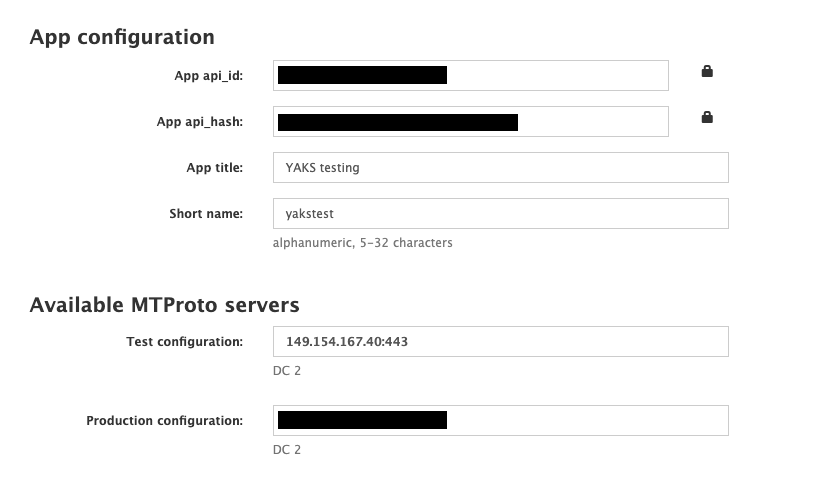

# Telegram Kamelet test

This test verifies the Telegram Kamelet source defined in [telegram-source.kamelet.yaml](telegram-source.kamelet.yaml)

## Objectives

The test verifies the Telegram Kamelet source by creating a Camel K integration that uses the Kamelet and listens for messages on the
Telegram chat.

### Test Kamelet source

The test performs the following high level steps:

*Preparation*
- Create a secret on the current namespace holding the Telegram credentials
- Link the secret to the test

*Scenario* 
- Create the Kamelet in the current namespace in the cluster
- Create the Camel K integration that uses the Kamelet
- Wait for the Camel K integration to start and listen for Telegram chat messages
- Create a new message on the Telegram chat
- Verify that the integration has received the message event

*Cleanup*
- Delete the Camel K integration
- Delete the secret from the current namespace

## Installation

The test assumes that you have access to a Kubernetes cluster and that the Camel K operator as well as the YAKS operator is installed
and running.

You can review the installation steps for the operators in the documentation:

- [Install Camel K operator](https://camel.apache.org/camel-k/latest/installation/installation.html)
- [Install YAKS operator](https://github.com/citrusframework/yaks#installation)

## Preparations

Before you can run the test you have to provide Telegram account credentials and setup a Telegram API account and session.
 
The account information should be added into the file [telegram-credentials.properties](telegram-credentials.properties). If you do not have this
information ready please continue to read the instructions below. The following sections will guide you through the steps to obtain
this information. 

The test will use the account credentials to connect to your Telegram chat bot.

When the test is executed the credentials will be automatically added as a secret in the current Kubernetes namespace. The secret is automatically created before the test using
the shell script [prepare-secret.sh](prepare-secret.sh).

If for any reason this script execution does not work for your OS or environment you may need to run this step manually on your cluster and
remove the prepare script from the [yaks-config.yaml](yaks-config.yaml).

### Setup Telegram API account

The Kamelet uses the [Telegram Bot API](https://core.telegram.org/bots/api) to connect with the chat messages. This means that the automated test cannot use the very same Telegram Bot API to
send messages. This is because of the general rule in Telegram that bots are not able to send/receive messages from bots (see [telegram bot rules](https://core.telegram.org/bots/faq#what-messages-will-my-bot-get)).

Following from that the automated test needs to use a different approach to send a message to a chat. This is why we need to use the application API provided by Telegram.

#### Create a Telegram API account

Go and visit [https://my.telegram.org/](https://my.telegram.org/) to create a new development API account. You will be prompted for your phone number that
 is used in your Telegram account and you will have to prove a proper phone code as authorization.
 
  
 
Once you have signed up for a development account you will be provided with an `app_id` and `app_hash`. Please add this information 
to the [telegram-credentials.properties](telegram-credentials.properties) (but keep this information private as it is linked to your personal Telegram account and allows access to it).
 
In addition to that you will be provided with a test configuration in particular the DC identifier (a number 1-3) and a test server IP address. 
Please add this information to the [telegram-credentials.properties](telegram-credentials.properties), too.
   
#### Create an account/bot in the Telegram test space

Telegram provides a separate set of test servers that can be used for testing. It is a good idea to use this test environment because messages will be
periodically wiped and we will not hit rate limits (e.g. for login attempts) of our private Telegram accounts when running the tests multiple times in a CI pipeline.

As the Telegram test space is completely separated from the production space you need to recreate your accounts and bots there once more. 

You can create test accounts when connecting in [Telegram test mode](https://web.telegram.org/?test=1).
Please do a complete new signup with your phone number in test mode. Do not share private information on this test account as it may be exposed to lower security standards on that test environment.

Once you have a test account go to `@BotFather` and create a bot as usual. To access the HTTP bot API in the Telegram test space just add `/test` to the end of your bot token.

```
https://api.telegram.org/bot{your-bot-token}/test/getMe
``` 

Now you have a test account and a test bot in the Telegram test space. Please add this information to the [telegram-credentials.properties](telegram-credentials.properties).

### Obtain session token

The usual Telegram login procedure involves a phone number and phone code where latter gets sent to you via SMS or Telegram itself. 

This login approach is not suitable for test automation as it involves a manual step for providing the phone number and code as input. 

Fortunately there is a way to obtain a session token we can then reuse in all subsequent calls as long as the session is kept alive on your Telegram account. 

You can obtain such session token with the [yaks/telegram-client](https://github.com/citrusframework/telegram-docker-image) Docker image that includes the
[Telethon](https://docs.telethon.dev/en/latest/) client library and a Python script to perform the login:

You can load the Docker image from [DockerHub](https://hub.docker.com/repository/docker/yaks/telegram-client) or build it locally:

_Build Docker image 'yaks/telegram-client'_
```shell script
git clone https://github.com/citrusframework/telegram-docker-image
cd telegram-docker-image
docker build -t yaks/telegram-client -f Dockerfile .
```

Please follow the `yaks/telegram-client` Docker image instructions to [obtain a session token](https://github.com/citrusframework/telegram-docker-image) and add the token 
to the [telegram-credentials.properties](telegram-credentials.properties).

### Test the session token

Now we can test the session token by sending a message to the test bot.

```shell script
docker run -i --rm --env-file docker/telegram-client.properties yaks/telegram-client
```

You should see the message on your Telegram bot now. The session token setup is complete and the automated tests
can send messages to bots now.

Please add all account information to the file [telegram-credentials.properties](telegram-credentials.properties) so the test
can use it to connect to the Telegram API.

Now you should be ready to run the test!

## Run the test

```shell script
$ yaks test telegram-source-uri-based.feature
$ yaks test telegram-source-prop-based.feature
$ yaks test telegram-source-secret-based.feature
```

You will be provided with the test log output and the test results.
